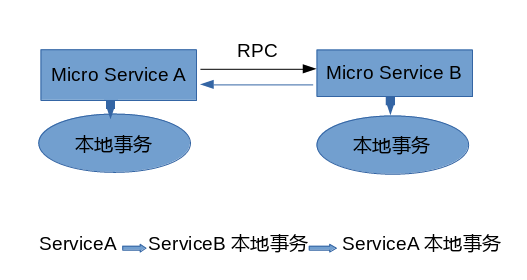

## 说明

TX-LCN 主要有两个模块，Tx-Client(TC) Tx-Manager(TM). TC作为微服务下的依赖，TM是独立的服务。   
本教程带领大家了解框架的基本步骤，详细配置可参考 [dubbo](demo/dubbo.md) [springcloud](demo/springcloud.md)

## TM配置与启动

### TM的准备环境

TM需要依赖的服务有
JDK1.8+,Mysql5.6+,Redis3.2+,Git,Maven

初始化TM Mysql数据库
创建数据库名称为:tx-manager

```sql
DROP TABLE IF EXISTS `t_tx_exception`;
CREATE TABLE `t_tx_exception`  (
  `id` bigint(20) NOT NULL AUTO_INCREMENT,
  `group_id` varchar(32) CHARACTER SET utf8mb4 COLLATE utf8mb4_general_ci NULL DEFAULT NULL,
  `unit_id` varchar(32) CHARACTER SET utf8mb4 COLLATE utf8mb4_general_ci NULL DEFAULT NULL,
  `mod_id` varchar(32) CHARACTER SET utf8mb4 COLLATE utf8mb4_general_ci NULL DEFAULT NULL,
  `transaction_state` tinyint(4) NULL DEFAULT NULL,
  `registrar` tinyint(4) NULL DEFAULT NULL COMMENT '-1 未知 0 Manager 通知事务失败， 1 client询问事务状态失败2 事务发起方关闭事务组失败',
  `ex_state` tinyint(4) NULL DEFAULT NULL COMMENT '0 待处理 1已处理',
  `create_time` datetime(0) NULL DEFAULT NULL,
  PRIMARY KEY (`id`) USING BTREE
) ENGINE = InnoDB AUTO_INCREMENT = 967 CHARACTER SET = utf8mb4 COLLATE = utf8mb4_general_ci ROW_FORMAT = Dynamic;

SET FOREIGN_KEY_CHECKS = 1;

```

### TM下载与配置

`git clone https://github.com/codingapi/tx-lcn.git `

修改配置信息(txlcn-tm\src\main\resources\application.properties)

```
spring.application.name=tx-manager
server.port=7970

spring.datasource.driver-class-name=com.mysql.jdbc.Driver
spring.datasource.url=jdbc:mysql://127.0.0.1:3306/tx-manager?characterEncoding=UTF-8
spring.datasource.username=root
spring.datasource.password=root

mybatis.configuration.map-underscore-to-camel-case=true
mybatis.configuration.use-generated-keys=true

#tx-lcn.logger.enabled=true
# TxManager Host Ip
#tx-lcn.manager.host=127.0.0.1
# TxClient连接请求端口
#tx-lcn.manager.port=8070
# 心跳检测时间(ms)
#tx-lcn.manager.heart-time=15000
# 分布式事务执行总时间
#tx-lcn.manager.dtx-time=30000
#参数延迟删除时间单位ms
#tx-lcn.message.netty.attr-delay-time=10000
#tx-lcn.manager.concurrent-level=128
# 开启日志
#tx-lcn.logger.enabled=true
#logging.level.com.codingapi=debug
#redisIp
#spring.redis.host=127.0.0.1
#redis\u7AEF\u53E3
#spring.redis.port=6379
#redis\u5BC6\u7801
#spring.redis.password=


```
* `#`给出信息都是默认值

关于详细配置说明见 [manager](setting/manager.md)

### TM编译与启动

编译  
进入到txlcn-tm路径下。 执行 `mvn clean  package '-Dmaven.test.skip=true'`   
启动  
进入target文件夹下。执行 `java -jar txlcn-tm-5.0.0.RELEASE.jar `

## TC微服务模块

微服务示例架构



* 服务A作为DTX发起方，远程调用服务B  


### TC引入pom依赖 

```xml
        <dependency>
            <groupId>com.codingapi.txlcn</groupId>
            <artifactId>txlcn-tc</artifactId>
            <version>5.0.1.RELEASE</version>
        </dependency>

        <dependency>
            <groupId>com.codingapi.txlcn</groupId>
            <artifactId>txlcn-txmsg-netty</artifactId>
            <version>5.0.1.RELEASE</version>
        </dependency>
```

###  TC开启分布式事务注解
 
在主类上使用`@EnableDistributedTransaction`
```java
@SpringBootApplication
@EnableDistributedTransaction
public class DemoAApplication {

    public static void main(String[] args) {
        SpringApplication.run(DemoDubboClientApplication.class, args);
    }

}
```

### TC微服务A业务方法配置
```java
@Service
public class ServiceA {
    
    @Autowired
    private ValueDao valueDao; //本地db操作
    
    @Autowired
    private ServiceB serviceB;//远程B模块业务
    
    @LcnTransaction //分布式事务注解
    @Transactional //本地事务注解
    public String execute(String value) throws BusinessException {
        // step1. call remote service B
        String result = serviceB.rpc(value);  // (1)
        // step2. local store operate. DTX commit if save success, rollback if not.
        valueDao.save(value);  // (2)
        valueDao.saveBackup(value);  // (3)
        return result + " > " + "ok-A";
    }
}
```
###  TC微服务B业务方法配置
```java
@Service
public class ServiceB {
    
    @Autowired
    private ValueDao valueDao; //本地db操作
    
    @LcnTransaction //分布式事务注解
    @Transactional  //本地事务注解
    public String rpc(String value) throws BusinessException {
        valueDao.save(value);  // (4)
        valueDao.saveBackup(value);  // (5)
        return "ok-B";
    }
}
```

### TC配置信息说明

```
# 默认之配置为TM的本机默认端口
tx-lcn.client.manager-address=127.0.0.1:8070 
```

